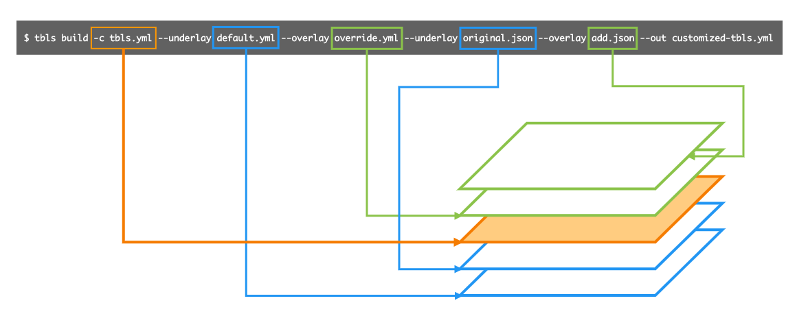

<p align="center">
<br>

<br>
<br>
</p>

[](https://github.com/k1LoW/tbls-build/actions) [](https://github.com/k1LoW/tbls-build/releases)

`tbls-build` is an external subcommand of [tbls](https://github.com/k1LoW/tbls) for customizing config file of [tbls](https://github.com/k1LoW/tbls) using other tbls.yml or schema.json.

## Usage

tbls-build is provided as an external subcommand of [tbls](https://github.com/k1LoW/tbls).

```
$ tbls build -c tbls.yml \
--underlay default.yml \
--overlay override.yml \
--underlay original.json \
--overlay add.json \
--out customized-tbls.yml
```

### Architecture

`tbls build` is a merge tool with a layered structure.



## Requirements

- [tbls](https://github.com/k1LoW/tbls) > 1.37.5
